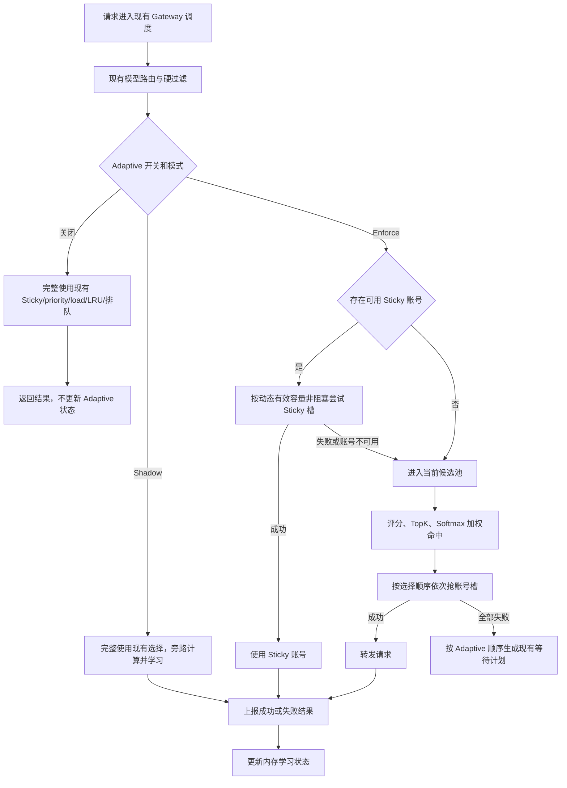

# Anthropic 自适应调度设计（单机版）

## 已确认约束

本方案按以下边界实施：

1. 只考虑单机部署，学习状态保存在进程内存。
2. 只提供一个 Anthropic 自适应调度总开关。
3. 开启后支持 `shadow`（观察）和 `enforce`（执行）两种模式。
4. 不引入分组灰度、流量百分比、Redis 学习状态或分布式 half-open。
5. 不重写现有模型路由、分组、模型映射、RPM、窗口费用、配额和排队逻辑。
6. 自适应调度代码放在独立文件中，通过少量 hook 接入现有 `GatewayService`。
7. 选择顺序固定为：先尝试 Sticky 立即取槽，Sticky 不可用或无空闲槽时才进入自适应打分和加权命中。
8. 默认关闭；关闭时行为必须与当前版本完全一致。

## 目标

1. 在同一批可用 Anthropic 账号中，减少持续命中高错误率、高延迟或已接近容量上限的账号。
2. 根据真实成功、失败、TTFT 和并发负载学习账号运行时稳定容量。
3. 保留 Sticky 带来的会话连续性和 Prompt Cache 亲和。
4. 保留少量探索流量，使新账号和恢复账号重新获得样本。
5. 自适应内部发生错误时自动回退现有调度，不影响请求可用性。

## 非目标

1. 不实现跨实例学习状态同步。
2. 不自动修改账号表的 `concurrency`、`load_factor`、`priority` 或倍率。
3. 不改变 Antigravity 混合调度语义。
4. 不让 `/v1/messages/count_tokens` 样本影响 Messages 推理调度。
5. 第一版不引入缓存命中率、token 速率、供应商成本等额外评分维度。
6. 第一版不实现复杂的账号/代理多层状态；健康和容量按账号学习，只为延迟保留小型模型族分桶。

## 审查结论

在修正 Sticky 等待语义、容量失败归因和冷启动容量后，这套方案可以满足单机 Anthropic
自适应调度，并有望提高稳定性。它不是稳定性的充分条件：上游全局故障、代理故障、凭据故障
和现有硬限流仍由原有机制负责；Adaptive 只优化通过硬过滤后的账号选择。

必须遵守三条安全边界：

1. Shadow 不改变任何实际选号、Sticky、槽位或排队行为。
2. Enforce 的 Sticky 只做一次非阻塞取槽；取槽失败后进入评分，不先返回 Sticky 等待计划。
3. 只有明确的账号级并发上限信号才能缩减学习容量。通用 429、529 和本地排队拥塞不能作为缩容证据。

## 总体设计

Anthropic 自适应调度器应和 OpenAI 自适应调度器一样，通过运行时开关选择实现，但不直接
复制 OpenAI 的完整选号逻辑。

现有 `GatewayService.SelectAccountWithLoadAwareness` 继续负责：

- 分组和平台解析。
- 模型路由。
- Sticky Session 查询和绑定。
- 账号状态、模型支持、配额、窗口费用和 RPM 过滤。
- 并发槽获取、会话限制和排队计划。
- Antigravity 混合调度。

新增 `anthropicAdaptiveScheduler` 只负责：

- 保存账号内存学习状态。
- 计算账号动态有效容量。
- 对已经通过现有硬过滤的候选账号打分。
- 生成加权随机选择顺序。
- 接收请求结果并更新成功率、错误率、TTFT、延迟和容量状态。
- 在 Shadow 模式记录 baseline 与 adaptive 决策差异。

## 选择顺序



### 模型路由不变

现有模型路由仍是候选范围的硬约束：

1. 请求命中模型路由时，只在路由账号集合内检查 Sticky 和执行自适应选择。
2. Sticky 账号不在当前模型路由集合时，不允许命中。
3. 路由集合不可用时，继续使用当前代码已有的普通池回退行为。
4. 自适应调度不修改模型路由配置，也不自行查询第二套候选账号。

### Priority 不变

账号 `priority` 继续作为硬分层，避免开启自适应调度后改变运营配置语义：

```text
先取当前最小 priority 的候选层
-> 在该层内做自适应打分和加权命中
-> 该层全部抢槽失败后再进入下一 priority 层
```

自适应分数不能绕过 priority、模型路由或任何现有硬过滤。

## Sticky 策略

### 命中条件

Sticky 账号满足以下条件时始终优先：

```text
账号仍可调度
AND 未在 ExcludedIDs
AND 属于当前分组和模型路由集合
AND 支持当前请求模型
AND 通过配额、窗口费用和 RPM 检查
AND 未处于现有 RateLimitResetAt / OverloadUntil / TempUnschedulableUntil
AND (effective_capacity <= 0 OR current_concurrency < effective_capacity)
```

满足条件并成功获得账号槽后，不再执行打分选择。`adaptive cooldown` 不把账号永久排除，
只暂停升容并使用收缩后的 `effective_capacity`；只要仍有容量，Sticky 依然优先。

### Sticky 不可用

Sticky 不可用时，当前请求进入自适应候选池：

- 账号永久不可用、模型不支持、认证失败：沿用现有逻辑清理 Sticky。
- 账号动态容量已满或短暂拥塞：本次绕过 Sticky，但保留原绑定。
- 本次绕过 Sticky 后选择了其他账号：沿用当前 Handler 语义，不覆盖已有绑定。

这里需要对现有行为做一处明确但局部的调整：当前实现会在 Sticky 槽满且等待队列未满时直接
返回 Sticky 等待计划。Enforce 模式必须跳过这次 Sticky 等待，继续进入 Adaptive 候选池；
否则评分路径不会执行。Shadow 和 Disabled 仍保持现有 Sticky 等待行为。Adaptive 候选全部
取槽失败后，才按 Adaptive 顺序使用现有 `FallbackWaitTimeout` / `FallbackMaxWaiting` 生成等待计划。

## 运行模式

### Disabled

```text
anthropic_adaptive_scheduler_enabled = false
```

- 完全使用当前调度逻辑。
- 不计算 Adaptive 候选顺序。
- 不更新 Adaptive 学习状态。
- 不产生 Adaptive 诊断日志。

### Shadow

```text
enabled = true
mode = shadow
```

- Sticky 和现有 baseline 选择实际生效。
- 使用 baseline 已构建的同一候选列表和负载快照计算 Adaptive 选择。
- Adaptive 不抢槽、不绑定或删除 Sticky、不改变排队顺序。
- 真实请求结果用于更新 Adaptive 学习状态。
- 记录 baseline 与 Adaptive 是否选择不同账号。
- Sticky 槽满但 baseline 返回 Sticky 等待计划时，记录 `sticky_would_bypass=true`；允许第一版
  不计算完整的替代账号，以免为 Shadow 复制一套候选过滤逻辑。

### Enforce

```text
enabled = true
mode = enforce
```

- Sticky 仍优先。
- Sticky 不可用或非阻塞取槽失败时由 Adaptive 生成候选顺序，原 Sticky 绑定保留。
- 按 Adaptive 顺序依次尝试获取账号槽。
- Adaptive 无候选、负载查询失败或内部异常时，回退当前 baseline 逻辑。

模式优先级：

```text
adaptive enforce > 当前 load-aware 选择
adaptive shadow  = 当前选择生效 + Adaptive 旁路观察
adaptive disabled = 当前选择
```

## 接口设计

```go
type AnthropicAdaptiveScheduleRequest struct {
    GroupID       *int64
    RequestedModel string
    Scope          string // model_route / load_balance
    Candidates     []*Account
    Loads          map[int64]*AccountLoadInfo
    ExcludedIDs    map[int64]struct{}
}

type AnthropicAdaptiveCandidate struct {
    Account           *Account
    EffectiveCapacity int
    Score             float64
    ReliabilityScore  float64
    CapacityScore     float64
    LatencyScore      float64
    ExplorationScore  float64
}

type AnthropicAdaptiveDecision struct {
    Order              []AnthropicAdaptiveCandidate
    CandidateCount     int
    TopK               int
    SelectedAccountID  int64
    BaselineAccountID  int64
    ShadowDiverged     bool
    FallbackReason     string
    LatencyMs          int64
}

type AnthropicAdaptiveScheduleReport struct {
    AccountID      int64
    RequestedModel string
    Success        bool
    HealthSample   bool
    CapacitySample bool
    FirstTokenMs   *int
    DurationMs     int64
    Cooldown       bool
    CooldownReason string
    TerminalReason string
    Err            error
}

type AnthropicAdaptiveScheduler interface {
    BuildOrder(
        ctx context.Context,
        req AnthropicAdaptiveScheduleRequest,
    ) (AnthropicAdaptiveDecision, error)

    Report(ctx context.Context, report AnthropicAdaptiveScheduleReport)
    SnapshotMetrics() AnthropicAdaptiveMetricsSnapshot
}
```

调度器只返回顺序，不直接操作 Repository、Sticky 或账号槽。这样可以保持自适应文件独立，
同时把现有路由模型和并发行为留在 `GatewayService` 中。

## 内存学习状态

第一版按账号维护状态，与 OpenAI 自适应调度器保持相近结构：

```go
type anthropicAdaptiveAccountState struct {
    AccountID int64

    EstimatedCapacity int
    SuccessEMA        float64
    LatencyByModelFamily map[string]anthropicAdaptiveLatencyState

    ConsecutiveSuccess         int
    ConsecutiveFailure         int
    ConsecutiveCapacityFailure int

    TotalSamples            int64
    RecentHealthSamples     int
    RecentHealthFailures    int
    RecentCapacitySamples   int
    RecentCapacityFailures  int

    LastSuccessAt         time.Time
    LastFailureAt         time.Time
    LastCapacityFailureAt time.Time
    RecentWindowStartedAt time.Time
    CooldownUntil         time.Time
}

type anthropicAdaptiveLatencyState struct {
    TTFTEMA    float64
    LatencyEMA float64
    Samples    int64
}
```

使用进程内 `map[int64]*anthropicAdaptiveAccountState` 和互斥锁保存。账号数量有限，不需要
Redis、数据库或复杂状态清理。进程重启后状态重新学习，这是单机版明确接受的行为。

`SuccessEMA` 和连续失败次数已经覆盖可靠性，第一版不再同时维护互为补集的 `ErrorEMA`，
也不引入未实际参与选择的 Thompson 状态。TTFT/Latency 只在同一归一化模型族内比较；没有
同模型族样本时使用中性分，避免 Opus、Sonnet、Haiku 的请求结构差异污染账号评分。模型族
延迟状态仍完全位于 Adaptive 内存中，不改变现有模型路由。模型族键只允许归一化后的固定集合
（如 `opus`、`sonnet`、`haiku`、`other`），不能直接使用任意原始模型字符串增长 map。

## 动态容量

```text
configured_capacity = account.concurrency
stable_capacity     = state.EstimatedCapacity
probe_capacity      = 高负载且健康时允许增加的 1 个探测槽
effective_capacity  = min(configured_capacity, stable_capacity + probe_capacity)
```

`account.concurrency` 继续作为实际并发槽硬上限。`EffectiveLoadFactor()` 仍只参与现有负载快照
和 `LoadRate < 100` 候选过滤，不改变 Sticky 的取槽上限。Adaptive 只能在 `concurrency` 内收缩
和恢复，不能放大账号配置。

当 `account.concurrency <= 0` 时，必须保留当前“不限并发”的语义：`effective_capacity=0`，
不进行容量收缩或升容，只参与健康、延迟和探索评分。不能把它转换为容量 `1`。

冷启动容量：

```text
initial = configured_capacity // concurrency > 0
```

不能照搬 OpenAI 的 10% 冷启动容量。单机内存状态会在进程重启后丢失，如果 Enforce 重启后
从 10% 起步，会在上游完全健康时主动制造排队。V1 从当前配置容量开始，只在有足够明确证据时
向下收缩，再通过成功探测恢复到配置上限。

升容条件：

```text
SuccessEMA >= 0.97
AND 当前负载 >= 80% 或 waiting_count > 0
AND 连续成功达到当前稳定容量
AND 不在 cooldown
```

升容：

```text
next = min(configured_capacity, current + 1)
```

缩容条件：

```text
连续容量类失败 >= 3
AND RecentCapacitySamples >= 30
AND RecentCapacityFailures / RecentCapacitySamples >= 25%
```

普通缩容使用 `floor(current * 0.85)`，严重连续失败使用 `floor(current * 0.60)`，最低为 `1`。
缩容后进入短 cooldown；cooldown 只禁止升容，不把账号从候选池硬排除。

### 容量类失败

第一版只把能明确归因到账号级并发上限的错误作为容量失败样本：

- 明确的 `concurrency_limit`。
- Anthropic 响应体或结构化错误中明确标识的账号级并发容量耗尽。

以下信号不能触发缩容：

- Anthropic 5h、7d、模型窗口限流和其他带明确 reset/window 的 429：由现有 `RateLimitService` 处理。
- 无法判定窗口类型的通用 429：记为短期健康失败或 cooldown，但证据不足以推断并发上限。
- 529 `overloaded_error`：通常是供应商级拥塞，不能归因到某个账号容量。
- 本地账号槽等待超时或队列满：它只说明请求需求超过当前可用槽；将其用于缩容会形成正反馈。
- 认证、请求参数、上下文长度、模型不存在和客户端断开。

本地等待量和高负载只能作为“存在升容探测需求”的信号，不能作为缩容信号。

## 评分模型

第一版只优化稳定性，不使用 `rate_multiplier` 或缓存命中率。

```text
score =
  0.50 * reliability_score +
  0.30 * capacity_score +
  0.15 * latency_score +
  0.05 * exploration_score
```

### 子分数

```text
reliability_score =
  SuccessEMA / (1 + 0.25 * ConsecutiveFailure)

capacity_score =
  (effective_capacity - current_concurrency) / effective_capacity

effective_capacity <= 0 时 capacity_score = 1

latency_score =
  同模型族内按候选账号 TTFTEMA 优先、LatencyEMA 兜底做反向归一化

exploration_score =
  1 / sqrt(TotalSamples + 1)
```

未知账号使用中性初值：

```text
SuccessEMA = 0.5
latency_score = 0.5
```

## 加权命中

评分不是简单选择最高分账号，而是生成带探索能力的选择顺序：

1. 对当前 priority 层候选计算分数。
2. 按分数降序取 TopK，默认 `TopK=8`。
3. 以 `temperature=0.35` 对 TopK 做 Softmax。
4. 按 Softmax 权重无放回抽样，生成 TopK 内的尝试顺序。
5. TopK 外账号按分数降序追加为兜底。

`exploration_score` 与 Softmax 本身已经给低样本账号保留命中概率，第一版不再额外叠加
`exploration_rate` 或 Thompson Sampling。探索仍必须满足现有全部硬过滤、priority 和动态容量限制。

## 结果反馈

反馈行为保持和 OpenAI 自适应调度器相近，只学习 Handler 最终可见的账号尝试结果，不改造
现有上游内部重试结构。

### 成功

转发成功后上报：

```go
AnthropicAdaptiveScheduleReport{
    AccountID:      account.ID,
    RequestedModel: requestedModel,
    Success:        true,
    HealthSample:   true,
    CapacitySample: account.Concurrency > 0,
    FirstTokenMs:   result.FirstTokenMs,
    DurationMs:     result.Duration.Milliseconds(),
    TerminalReason: "success",
}
```

### 失败

错误分类遵循以下原则：

| 错误 | HealthSample | CapacitySample |
| --- | --- | --- |
| 客户端取消/断开 | 否 | 否 |
| 本地请求校验、上下文过长、非法参数 | 否 | 否 |
| 模型/能力不匹配 | 否 | 否 |
| 401/403 账号级认证失败 | 是 | 否 |
| Anthropic 5h/7d/模型窗口 429 | 否 | 否 |
| 无明确窗口信号的通用 429 | 是 | 否 |
| 529 provider overloaded | 否 | 否 |
| 500/502/503/504 | 仅账号/代理可归因时是 | 否 |
| transport/TLS/proxy/读超时 | 是 | 否 |
| 明确账号级 concurrency limit | 是 | 是 |
| 本地账号队列满/等待超时 | 否 | 否 |

现有 `UpstreamFailoverError.HealthSample`、`Stage`、`Scope`、`FailureKind` 和
`ShouldReportAccountScheduleFailure()` 优先于字符串判断。

429、529 的持久化限流和过载时间继续由 `RateLimitService` 管理。窗口限流已经通过硬过滤
排除，再写入 Adaptive 健康会造成双重惩罚，所以明确窗口 429 不更新 Adaptive 状态。
Adaptive 不再次写 `RateLimitResetAt` 或 `OverloadUntil`。

## 配置

管理端只暴露两个配置：

| Key | 默认值 | 说明 |
| --- | --- | --- |
| `anthropic_adaptive_scheduler_enabled` | `false` | 总开关 |
| `anthropic_adaptive_scheduler_mode` | `shadow` | `shadow` / `enforce` |

TopK、Softmax 温度、EMA、容量增长和缩减参数第一版使用代码内默认值，不在设置页
暴露。后续确有调参需求时再增加高级配置，避免复制 OpenAI 设置页的大量参数。

设置读取沿用 OpenAI 的短 TTL + singleflight + generation 模式，保证热路径不会每次访问
数据库。切换开关或模式后最多在短缓存 TTL 内生效。

## 代码组织

新增独立文件：

```text
backend/internal/service/anthropic_adaptive_scheduler.go
backend/internal/service/anthropic_adaptive_scheduler_state.go
backend/internal/service/anthropic_adaptive_scheduler_score.go
backend/internal/service/anthropic_adaptive_scheduler_failure.go
backend/internal/service/anthropic_adaptive_scheduler_settings.go
backend/internal/service/anthropic_adaptive_scheduler_test.go
```

文件职责：

- `anthropic_adaptive_scheduler.go`：接口、模式分支、候选顺序和指标。
- `anthropic_adaptive_scheduler_state.go`：内存状态、EMA、容量增长/缩减和 cooldown。
- `anthropic_adaptive_scheduler_score.go`：评分、TopK、Softmax 和探索。
- `anthropic_adaptive_scheduler_failure.go`：结果上报和错误分类。
- `anthropic_adaptive_scheduler_settings.go`：总开关、模式、短 TTL 缓存和校验。
- `anthropic_adaptive_scheduler_test.go`：核心行为单测。

### GatewayService 接线

`GatewayService` 增加：

```go
anthropicSchedulerMu sync.Mutex
anthropicScheduler   AnthropicAdaptiveScheduler
```

以及以下 facade：

```go
func (s *GatewayService) getAnthropicAdaptiveScheduler(ctx context.Context) AnthropicAdaptiveScheduler
func (s *GatewayService) ReportAnthropicAdaptiveSuccess(...)
func (s *GatewayService) ReportAnthropicAdaptiveFailure(...)
```

### gateway_scheduling.go 最小修改

只在四类位置增加 hook：

1. 两个 Sticky 分支：Disabled/Shadow 保持现有等待；Enforce 非阻塞取槽失败后不返回等待计划。
2. 模型路由完成硬过滤、负载批查和现有 `LoadRate < 100` 过滤，路由内 Sticky 未命中后。
3. 普通 Sticky 未命中，Layer 2 完成硬过滤、负载批查和现有 `LoadRate < 100` 过滤后。
4. Enforce 的 Layer 3 排队使用 Adaptive 已生成的候选顺序和有效容量；Adaptive 失败则使用原顺序和原容量。

原候选构建、硬过滤、模型路由和 fallback 代码不迁移到新调度器文件。

接入只对原生 Anthropic 候选生效。`Antigravity` 混合调度、Gemini 兼容路径和
`count_tokens` 继续走 baseline，避免改写现有跨平台选择语义。

### gateway_handler.go 最小修改

在 `Forward` 返回后增加对称上报：

- 成功：上报 TTFT、Duration 和成功样本。
- 失败：每次账号尝试失败后、现有 failover 处理前上报一次分类结果。
- 客户端断开和请求级错误不上报健康失败。

不修改现有使用量记录、计费和 failover 状态机。

### 设置页面

在 Gateway 设置中增加一个紧凑配置块：

```text
Anthropic 自适应调度

[开关] 启用自适应调度
[模式] 观察 / 执行
```

关闭时模式控件置灰。无需展示容量、权重、EMA 和 Softmax 参数。

## Shadow 日志与指标

Shadow 日志：

```text
anthropic_adaptive_shadow_decision
```

字段：

```text
baseline_account_id
adaptive_account_id
shadow_diverged
scope
candidate_count
top_k
sticky_would_bypass
selected_score
effective_capacity
model
```

运行指标：

```text
anthropic_adaptive_select_total
anthropic_adaptive_shadow_diverge_total
anthropic_adaptive_fallback_total
anthropic_adaptive_sticky_hit_total
anthropic_adaptive_exploration_total
anthropic_adaptive_capacity_increase_total
anthropic_adaptive_capacity_decrease_total
anthropic_adaptive_scheduler_latency_ms
```

第一版不要求新增复杂 Ops 页面。Shadow 的 `shadow_diverged` 只是决策差异，不是“Adaptive
一定更优”的反事实证明，因为真实结果只来自 baseline 实际选中的账号。切换 Enforce 前至少
确认：Adaptive 有候选率稳定、fallback 率没有异常、容量不持续单向收缩、错误分类中没有大量
unknown。指标标签不得使用未经归一化的原始模型名，避免高基数。

## 回滚

```text
enforce -> shadow：立即恢复现有实际选择，保留内存学习
enabled -> false：完全关闭自适应选择和学习
```

不涉及数据库迁移和持久状态清理。需要完全重新学习时重启单机进程即可。

## 测试计划

### 配置和模式

1. 默认关闭时与当前调度结果一致。
2. Shadow 的真实选择始终来自 baseline。
3. Shadow 不抢第二次槽、不修改 Sticky、不改变排队。
4. Enforce 内部异常自动回退 baseline。
5. 非法 mode 回退 `shadow` 或拒绝保存。
6. Enforce 冷启动或进程重启后不会把容量降到现有配置以下。

### Sticky

1. 可用 Sticky 永远优先于最高分候选。
2. Sticky 在 `ExcludedIDs` 时不命中。
3. Sticky 动态容量满时进入加权选择。
4. 临时绕过 Sticky 不清理、不覆盖原绑定。
5. 永久不可用 Sticky 沿用现有清理语义。
6. Shadow 下 Sticky 槽满仍返回现有 Sticky 等待计划。
7. Enforce 下 Sticky 槽满不先返回 Sticky 等待计划。

### 路由与过滤

1. Adaptive 不能选择模型路由集合外账号。
2. Adaptive 不能选择被现有硬过滤排除的账号。
3. 当前 priority 层有槽时不能跳到下一层。
4. Antigravity 混合候选继续走 baseline。
5. `ExcludedIDs` 在评分、探索和排队中都生效。

### 评分和容量

1. 高成功率、低负载账号获得更高分。
2. TTFT 较低账号在其他条件相同时获得更高分。
3. 未学习账号保持中性分并能通过 Softmax 获得探索机会。
4. 动态容量不超过正数 `concurrency`，`concurrency <= 0` 时保持不限并发。
5. 成功高负载触发升容。
6. 样本不足或非容量错误不触发缩容。
7. 连续容量错误达到阈值后缩容。
8. cooldown 期间仍可参与选择，但不能升容。
9. 不同模型族的 TTFT 样本不会互相比较。

### 反馈分类

1. 成功只上报一次。
2. 客户端断开不降低成功率。
3. 请求级 400 不降低账号健康。
4. 5h/7d/模型窗口 429 不更新 Adaptive 健康或容量。
5. 通用 429 影响短期健康但不缩容；provider 级 529 不归因到账号。
6. 认证和 transport 错误只影响健康，不影响容量。
7. 只有明确账号级 concurrency limit 参与缩容。
8. 本地队列满或等待超时不参与缩容。
9. `concurrency <= 0` 的账号不会被 Adaptive 变成容量 `1`。

## 实施顺序

1. 实现开关、模式和设置缓存。
2. 实现内存状态、结果反馈和错误分类。
3. 实现评分、TopK、Softmax 和探索。
4. 在普通候选池接入 Shadow。
5. 在模型路由候选池接入 Shadow。
6. 接入 Sticky 动态容量判定。
7. 接入 Enforce 和排队顺序。
8. 增加设置页面、日志、指标和完整回归测试。

该方案的改动集中在独立自适应文件与 `gateway_scheduling.go`、`gateway_handler.go` 的少量
hook，不需要重构现有 Anthropic 路由模型。
