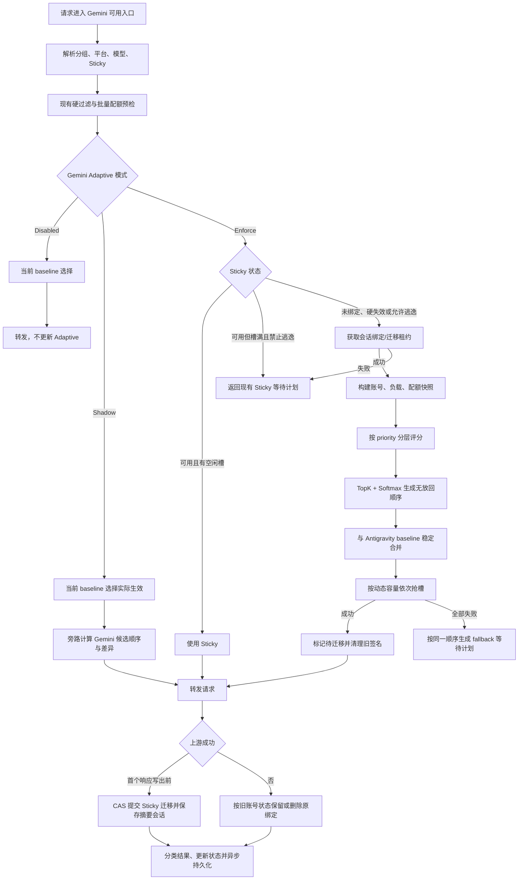

# Gemini 自适应调度设计（原生 Gemini 与 Antigravity 混合池）

## 结论

Gemini 自适应调度不能直接复制 OpenAI 的成本与并发学习，也不能把 Antigravity 的模型级
限流处理等同于账号健康学习。第一版采用以下组合：

1. 复用 OpenAI 自适应调度的 `Disabled / Shadow / Enforce`、动态容量、TopK + Softmax、
   结果反馈、Redis 检查点和运维学习面板。
2. 复用 Antigravity 的错误作用域思想，区分账号配额、模型配额、供应商模型容量与请求错误。
3. 增加 Gemini 特有的共享配额桶、Pro/Flash 独立配额桶和配额消耗节奏评分。
4. 把 `thoughtSignature` 与账号绑定作为硬约束。自适应成功切换账号时必须清理旧签名并把
   Sticky 绑定迁移到新账号，不能像 Anthropic 的临时逃逸一样永久保留旧绑定。
5. 只学习和排序原生 `gemini` 账号。混合池中的 `antigravity` 账号继续使用现有规则，
   Gemini Adaptive 通过稳定合并方式保持其相对位置和限流语义。

当前仓库没有独立命名的 `antigravityAdaptiveScheduler`。本文所称“参考 Antigravity”是指复用
现有 `antigravity_gateway_retry.go`、模型级限流、`RetryInfo` 解析和混合调度中的作用域设计，
不是复制一个不存在的调度器实现。

## 当前基线

Gemini 原生请求目前通过 `GatewayService.SelectAccountWithLoadAwareness` 选择账号，主要顺序为：

```text
分组/平台解析
-> Sticky Session
-> 状态、模型、模型限流、配额、窗口费用、RPM 硬过滤
-> priority
-> load rate
-> last used at
-> 同条件下偏好 OAuth
-> 抢账号并发槽或生成等待计划
```

现有实现还有四个不能破坏的行为：

1. Gemini 分组可混入启用了 `mixed_scheduling` 的 Antigravity 账号。
2. `RateLimitService.PreCheckUsageBatch` 已按账号层级和 Pro/Flash 模型类预检 RPD/RPM。
3. Gemini CLI 会话和内容摘要会话会绑定上游账号；`thoughtSignature` 跨账号不可复用。
4. Native、Claude Messages、OpenAI Chat Completions 和 Responses 外观最终可能共用同一套
   `GatewayService` 账号选择。

## 目标

1. 默认关闭，关闭时选择、Sticky、排队、重试和错误处理与当前实现一致。
2. Shadow 模式只旁路计算和学习，不抢槽、不改缓存、不清理签名、不改变实际顺序。
3. Enforce 模式在现有全部硬过滤之后，对原生 Gemini 候选做自适应排序和动态容量控制。
4. 感知共享配额和 Pro/Flash 独立配额，优先使用配额消耗节奏健康的账号。
5. 只让可归因到账号并发的错误影响动态容量，避免把普通 429 或供应商容量不足误学成低并发。
6. 在模型族内学习成功率、TTFT 和总延迟，避免 Pro、Flash 和图片请求互相污染。
7. 支持学习状态持久化、运维查询、灰度和一键回滚。

## 非目标

1. 不自动修改账号表中的 `concurrency`、`priority`、`load_factor` 或 `rate_multiplier`。
2. 不替换 `RateLimitService`、Gemini 本地配额预检或 Antigravity 智能重试。
3. 不让自适应分数绕过分组、平台、模型支持、渠道限制、配额、RPM 或任何现有硬过滤。
4. 不在第一版学习任意原始模型名，所有状态键必须来自固定模型族或固定配额桶集合。
5. 不对 `/antigravity` 强制平台请求启用 Gemini Adaptive。
6. 不对 `GET /v1beta/models` 和 `GET /v1beta/models/{model}` 这类控制面请求做自适应学习。
7. 不把 Redis 检查点当成多实例实时共识。热路径状态仍是实例内状态，Redis 只用于启动恢复和
   尽力持久化。

## 安全边界

第一版必须满足以下约束：

1. Shadow 不能调用槽位获取、写 Sticky、删除 Sticky、清理签名或写限流状态。
2. `priority` 是硬分层。低优先级账号的高分不能越过高优先级层。
3. 429 配额错误永远不是并发缩容证据。
4. `MODEL_CAPACITY_EXHAUSTED` 属于供应商模型作用域，不惩罚单个账号容量。
5. 本地队列满、等待超时和客户端断开不进入账号健康或容量失败样本。
6. 自适应内部异常、配额快照失败或负载批量查询失败时回退当前 baseline。
7. Gemini 会话成功切换账号后必须迁移 Sticky 绑定；迁移请求成功前不能提前覆盖旧绑定。

## 生效范围

| 场景 | Gemini Adaptive 行为 |
| --- | --- |
| 原生 Gemini 分组，只含 `gemini` 账号 | 对全部候选生效 |
| Gemini 分组，混入 Antigravity | 只重排原生 Gemini 子序列，稳定合并 Antigravity |
| Composite 最终解析到 Gemini | 与 Gemini 分组相同 |
| `/antigravity` 强制平台 | 完全旁路 |
| 最终选择到 Antigravity 账号 | 不写 Gemini 学习状态 |
| Native `generateContent` / `streamGenerateContent` | 生效并反馈 |
| Claude/OpenAI 外观转发到原生 Gemini | 生效并反馈 |
| `countTokens` 真实上游成功 | 可记录健康，不记录 TTFT |
| `countTokens` 本地估算兜底 | 不作为成功或失败样本 |
| List/Get Model | 保持现有简单选择，不学习 |

## 总体流程



## 运行模式

### Disabled

```text
gemini_adaptive_scheduler_enabled = false
```

- 不读取学习状态。
- 不构建配额分数。
- 不产生 Adaptive 日志和指标。
- 完整执行当前调度逻辑。

### Shadow

```text
enabled = true
mode = shadow
```

- Baseline 的 Sticky、候选顺序、槽位和等待计划实际生效。
- 使用 baseline 已构建的同一候选集合、负载快照和配额快照旁路计算。
- 真实的原生 Gemini 转发结果更新学习状态。
- 记录 baseline 与 adaptive 首选账号、平台和配额桶是否不同。
- Sticky 槽满时可记录 `sticky_escape_candidate`，但不抢迁移租约或真的切换。

### Enforce

```text
enabled = true
mode = enforce
```

- 可用 Sticky 账号仍先做一次非阻塞取槽。
- Sticky 硬失效时进入 Adaptive 候选池。
- Sticky 只因容量已满时默认返回现有等待计划；显式开启容量逃逸后才允许迁移。
- 按 Adaptive 顺序和动态容量抢槽。
- 若切换账号，由 Handler 清理旧 `thoughtSignature`，在首个客户端可见响应写出前提交迁移。
- 自适应无候选或内部失败时回退 baseline。

模式优先级：

```text
gemini adaptive enforce > 当前 Gemini load-aware
gemini adaptive shadow  = 当前 Gemini load-aware + 旁路观察
gemini adaptive disabled = 当前 Gemini load-aware
```

## 候选硬过滤

Adaptive 只能接收已经通过以下检查的候选：

```text
账号 active 且 schedulable
AND 未在 ExcludedIDs
AND 属于解析后的分组和平台范围
AND 支持请求模型及账号模型映射
AND 未命中账号级 RateLimitResetAt / OverloadUntil / TempUnschedulableUntil
AND 未命中当前模型或 Gemini 配额桶限流
AND 通过 RateLimitService.PreCheckUsageBatch
AND 通过窗口费用与 RPM 检查
AND 通过渠道和能力限制
```

配额快照、学习状态或延迟样本缺失只能影响软分数，不能额外硬排除账号。只有现有硬过滤或明确
的配额预检结果可以排除候选。

## Priority 与现有偏好

`priority` 保持硬分层：

```text
先处理数值最小的 priority 层
-> 该层全部非阻塞取槽失败
-> 才进入下一 priority 层
```

当前“同等条件偏好 OAuth”不升级为跨层规则。自适应分数相同或状态均未知时，使用以下确定性
兜底：

```text
较低 load rate
-> 从未使用
-> OAuth 优先
-> 更早 last used at
-> 更小 account ID
```

## Antigravity 混合池

Gemini 和 Antigravity 的配额、错误和延迟含义不同，不能放进同一个分数直接比较。混合池按
priority 层执行稳定合并：

1. 使用当前规则为整个 priority 层生成 baseline 顺序。
2. 保留所有 Antigravity 账号在 baseline 中的位置和相对顺序。
3. 提取原生 Gemini 账号占据的位置。
4. 只对原生 Gemini 子序列做 Adaptive 排序。
5. 把重排后的 Gemini 账号填回原生 Gemini 的原位置。

示例：

```text
baseline:  G1, A1, G2, A2, G3
adaptive Gemini order: G3, G1, G2
merged:    G3, A1, G1, A2, G2
```

其中 `G` 表示原生 Gemini，`A` 表示 Antigravity。这样可以优化 Gemini 子池，同时不让 Gemini
分数改变 Antigravity 现有混合调度权重。Antigravity 被实际选择后仍由其现有重试、模型限流和
配额状态负责，不能写 Gemini Adaptive 状态。

## Gemini 配额桶

### 桶解析

Gemini 配额同时存在每日和每分钟两个维度，两者可能分别共享或按模型类隔离。因此不能只保存
一个笼统的 `quota_scope`，需要分别解析：

```go
type GeminiAdaptiveQuotaBucket string

const (
    GeminiQuotaBucketShared    GeminiAdaptiveQuotaBucket = "shared"
    GeminiQuotaBucketPro       GeminiAdaptiveQuotaBucket = "pro"
    GeminiQuotaBucketFlash     GeminiAdaptiveQuotaBucket = "flash"
    GeminiQuotaBucketUnlimited GeminiAdaptiveQuotaBucket = "unlimited"
    GeminiQuotaBucketUnknown   GeminiAdaptiveQuotaBucket = "unknown"
)

type GeminiAdaptiveQuotaScope struct {
    Daily  GeminiAdaptiveQuotaBucket
    Minute GeminiAdaptiveQuotaBucket
}
```

解析规则：

```text
SharedRPD > 0  -> Daily=shared
否则按账号最终映射模型解析 Daily=pro/flash
SharedRPM > 0  -> Minute=shared
否则按账号最终映射模型解析 Minute=pro/flash
配额为 -1     -> 对应维度 unlimited
策略或数据缺失 -> unknown
```

模型类必须基于该候选账号最终上游模型计算，不能只看客户端别名。固定配额模型类仍沿用当前
`geminiModelClassFromName` 的 `pro / flash` 语义。

### 配额快照

扩展当前批量预检，单次查询同时返回是否可调度和只读快照：

```go
type GeminiAdaptiveQuotaSnapshot struct {
    Scope              GeminiAdaptiveQuotaScope
    DailyUsed          int64
    DailyLimit         int64
    DailyResetAt       time.Time
    MinuteUsed         int64
    MinuteLimit        int64
    MinuteResetAt      time.Time
    HardRejected       bool
    DataAvailable      bool
}
```

调度器本身不能访问 Usage Repository。`GatewayService` 在现有 `PreCheckUsageBatch` 相同阶段完成
一次批量读取，并把快照传给调度器。快照失败时保留候选并使用中性配额分，不能让可观测数据
故障演变为无账号可用。

配额快照是尽力而为的数据，不是精确配额账本。当前用量日志异步落库，同一时刻完成但尚未落库
的请求可能暂时不可见。软评分可把账号 `CurrentConcurrency` 作为 MinuteUsed 的保守增量，但不能
据此写持久限流。第一版继续以现有预检和上游 429 为硬事实；如果后续需要严格防止临界配额超发，
应另行增加按账号与配额桶原子预占、成功提交和失败释放的短期计数器，不把该一致性职责塞进
Adaptive 学习状态。

### 配额节奏分

```text
remaining_ratio = clamp(1 - used / limit, 0, 1)
remaining_time_ratio = clamp(time_to_reset / window_duration, 0.05, 1)
daily_pacing = clamp(remaining_ratio / remaining_time_ratio, 0, 1)
daily_score = 0.5 * remaining_ratio + 0.5 * daily_pacing
minute_score = minute_remaining_ratio
quota_score = min(daily_score, minute_score)
```

特殊值：

```text
unlimited -> 1.0
unknown   -> neutral_quota_score，默认 0.5
hard rejected -> 已在评分前排除
```

该分数会优先使用消耗低于时间进度的账号，避免某个低配额账号在窗口前半段被过早耗尽。它不
取代本地 RPD/RPM 硬预检。

### 429 持久化作用域

参考 Antigravity 的模型级限流，Gemini 429 先解析 `google.rpc.QuotaFailure`、`ErrorInfo`、
`RetryInfo`、`quotaResetDelay` 和请求的最终模型：

| 可确认作用域 | 持久化行为 |
| --- | --- |
| 共享账号配额 | 沿用 `RateLimitResetAt` |
| Pro 独立配额 | 写 `gemini:quota:pro` 模型作用域限流 |
| Flash 独立配额 | 写 `gemini:quota:flash` 模型作用域限流 |
| 明确单一最终模型配额 | 写最终模型作用域限流 |
| 供应商 `MODEL_CAPACITY_EXHAUSTED` | 不写账号限流，只记供应商模型事件 |
| 无法确认 | 沿用当前账号级限流兜底 |

`isAccountSchedulableForModelSelection` 需要同时检查最终模型 key 和 Gemini 配额桶 key。
`gemini:quota:*` 可继续存放在账号 `extra.model_rate_limits`，不需要数据库迁移。

Adaptive 不再次写任何限流状态，只消费上述硬状态和快照。

## Sticky 与 thoughtSignature

Gemini Sticky 比普通亲和更强，因为响应中的 `thoughtSignature` 与产生它的上游账号相关。

### Sticky 命中

Sticky 账号必须通过全部硬过滤，并在其动态有效容量内成功非阻塞取槽。命中后刷新当前 TTL，
不进入评分。

### Sticky 不可用

按原因区分：

| 原因 | 绑定行为 |
| --- | --- |
| 账号禁用、认证失效、永久不支持模型 | 获取迁移租约；成功迁移，失败则删除旧绑定 |
| 当前模型或配额桶限流 | 获取迁移租约；成功迁移，失败则删除旧绑定 |
| 动态容量已满，容量逃逸关闭 | 保持当前绑定并返回现有 Sticky 等待计划 |
| 动态容量已满，容量逃逸开启 | 获取迁移租约；成功响应前迁移，失败保留旧绑定 |
| 本地负载读取失败 | 回退 baseline |
| Adaptive 内部失败 | 回退 baseline |

第一版默认 `sticky_escape_on_capacity_full=false`。这与 Anthropic Adaptive 不同：Gemini 的账号
切换会改变签名来源，不能仅为减少一次排队就默认破坏会话亲和。新会话和硬失效后的重新选择仍
使用完整 Adaptive；容量逃逸应在 Shadow 观察迁移率和签名错误后单独开启。

Enforce 模式切换到新账号时必须表达以下语义：

```text
选到新账号
-> 持有当前 session 的短期迁移租约
-> 返回 PendingStickyMigration，不覆盖 Sticky 缓存
-> Handler 根据本请求开始时预取的旧账号 ID 清理 thoughtSignature
-> 非流式响应写出前或流式首个有效事件写出前 CAS(old_account, new_account)
-> CAS 成功后保存新摘要会话并释放租约
```

如果迁移尝试失败且旧账号只是动态容量已满，保留旧绑定，客户端下一轮仍可携带旧账号签名重试。
如果旧账号已经认证失效、模型限流或永久不可用，则使用 compare-and-delete 删除旧绑定。不能在
上游成功前直接写新账号：失败响应不会给客户端产生可继续使用的新签名，提前改绑会让下一轮把
旧签名发送给新账号。

成功后也不能永久保留旧绑定。客户端已经收到新账号产生的签名，如果缓存仍指向旧账号，下一轮
会形成反向错配。因此这里需要“选择阶段暂缓写入，成功阶段 CAS 提交”，而不是直接复用
Anthropic `PreserveStickyBinding` 的完整语义。

仅有 CAS 仍不够。两个同会话请求如果并发选择 B、C，即使只有一个 CAS 成功，另一个请求仍可能
把失败 CAS 账号产生的签名返回给客户端。Gateway Cache 需要提供基于 Lua 或等价原子能力的：

```text
TryAcquireSessionMigrationLease(group, session, token, ttl)
CompareAndSwapSessionAccountID(group, session, expected, target, token)
CompareAndDeleteSessionAccountID(group, session, expected, token)
ReleaseSessionMigrationLease(group, session, token)
```

同一会话只有租约持有者可以首次建立绑定或离开当前绑定。未获得租约的请求短暂等待绑定完成并
重新读取，超时后走当前 Sticky 等待语义，不能独立选择第二个目标账号。首次绑定使用
`expected_account_id=0`，`signature_source_account_id=0`；这样也能避免两个并发首轮请求分别把
不同账号的签名返回到同一会话。租约必须有短 TTL 和 token 校验，防止持有者崩溃后永久阻塞。

迁移提交点必须早于第一个客户端可见的上游内容：非流式在写响应 body 前，流式在写第一个有效
Gemini/SSE 事件前。若在此之前失败，可以保留或删除旧绑定；一旦内容已经写出，绑定必须指向
产生该内容的新账号，即使流后半段随后中断。各协议转发器需要共用一个一次性
`CommitGeminiStickyMigrationBeforeWrite` 回调，不能等 `Forward` 完整返回后再提交。

Shadow 模式只能记录 `sticky_would_migrate`，不能改绑定或请求体。

## 调度接口

调度器只接收快照并返回顺序，不直接访问 Repository、Redis、Sticky 或并发服务：

```go
type GeminiAdaptiveScheduleRequest struct {
    RequestedModel string
    Stream         bool
    Action         string
    Candidates     []GeminiAdaptiveCandidateInput
    BaselineOrder  []int64
    Settings       *GeminiAdaptiveSchedulerSettings
}

type GeminiAdaptiveCandidateInput struct {
    Account *Account
    Load    *AccountLoadInfo
    Quota   GeminiAdaptiveQuotaSnapshot
}

type GeminiAdaptiveCandidate struct {
    Account             *Account
    Load                *AccountLoadInfo
    EffectiveCapacity   int
    Score               float64
    ReliabilityScore    float64
    QuotaScore          float64
    CapacityScore       float64
    LatencyScore        float64
    CostScore           float64
    ExplorationScore    float64
}

type GeminiAdaptiveDecision struct {
    Order             []GeminiAdaptiveCandidate
    SelectedAccountID int64
    CandidateCount    int
    TopK              int
    FallbackReason    string
}

type GeminiPendingStickyMigration struct {
    GroupID                  int64
    SessionKey               string
    ExpectedAccountID        int64
    SignatureSourceAccountID int64
    ToAccountID              int64
    LeaseToken               string
    DeleteSourceOnFailure    bool
}

type GeminiAdaptiveScheduleReport struct {
    Account        *Account
    RequestedModel string
    MappedModel    string
    Stream         bool
    Action         string
    Success        bool
    PathSample     bool
    ModelSample    bool
    CapacitySample bool
    Synthetic      bool
    FirstTokenMs   *int
    DurationMs     int64
    TerminalReason string
}

type GeminiAdaptiveScheduler interface {
    BuildOrder(GeminiAdaptiveScheduleRequest) (GeminiAdaptiveDecision, error)
    Report(GeminiAdaptiveScheduleReport)
    SnapshotMetrics() GeminiAdaptiveMetricsSnapshot
}
```

`Stream` 和 `Action` 从 Handler 通过一个固定的 request hint 放入 context，避免继续扩张公共
`SelectAccountWithLoadAwareness` 参数列表。缺少 hint 时按 `generateContent` 非流式处理，但不影响
硬过滤。

待迁移信息由 `GatewayService` 附加到 `AccountSelectionResult`，不属于纯评分器的输入或学习状态。
Handler/转发器负责在首次写响应前 CAS 提交，在此前失败时按 `DeleteSourceOnFailure`
compare-and-delete，并始终释放租约。Disabled 和 Shadow 的 SelectionResult 不携带该字段。

## 学习状态

账号路径健康与模型族表现分开保存：

```go
type geminiAdaptiveAccountState struct {
    AccountID int64

    EstimatedCapacity int
    PathSuccessEMA     float64

    ByModelFamily map[string]geminiAdaptiveModelState

    ConsecutiveSuccess         int
    ConsecutiveFailure         int
    ConsecutiveCapacityFailure int

    TotalSamples            int64
    RecentHealthSamples     int
    RecentHealthFailures    int
    RecentCapacitySamples   int
    RecentCapacityFailures  int

    LastSuccessAt         time.Time
    LastFailureAt         time.Time
    LastCapacityFailureAt time.Time
    RecentWindowStartedAt time.Time
    CooldownUntil         time.Time
    UpdatedAt             time.Time

    revision          uint64
    persistedRevision uint64
}

type geminiAdaptiveModelState struct {
    SuccessEMA  float64
    TTFTEMA     float64
    LatencyEMA  float64
    Samples     int64
    Failures    int64
}
```

模型族只允许固定集合：

```text
pro
flash
image
embedding
other
```

请求存在图片生成语义时优先归入 `image`，Embedding 入口归入 `embedding`，其余再按模型名归入
`pro / flash / other`。不允许直接用原始模型名作为 map key。

路径健康用于代理、TLS、认证和账号级传输问题；模型状态用于特定模型族的成功率与延迟。这样
既不会让 Pro 的供应商问题完全污染 Flash，也能让共享代理故障影响整个账号。

## 状态持久化

沿用现有通用 `AdaptiveSchedulerStateCache`：

```text
namespace = gemini
schema_version = 1
启动时扫描恢复一次
每 5 分钟带抖动刷脏 revision
仅恢复 12 小时内状态
Redis 失败不影响调度
关闭时尽力执行一次短超时 flush
```

需要在 `adaptive_scheduler_state_persistence.go` 增加
`adaptiveSchedulerStateNamespaceGemini = "gemini"`。配额使用量和 reset 时间是派生实时数据，不进入
Adaptive 持久化载荷，避免恢复过期配额快照。

多实例之间不实时合并 EMA。全局账号槽仍由现有并发服务约束，Redis Adaptive 状态只帮助实例
重启后避免完全冷启动。

## 动态容量

```text
configured_capacity = account.concurrency
stable_capacity     = state.EstimatedCapacity
probe_capacity      = 高负载且健康时最多 1 个探测槽
effective_capacity  = min(configured_capacity, stable_capacity + probe_capacity)
```

规则：

1. `account.concurrency <= 0` 保持现有不限并发语义，`effective_capacity=0`，不学习容量。
2. 冷启动从配置容量开始，不能像早期 OpenAI 方案一样按小比例启动。否则进程重启会主动制造
   Gemini CLI 排队。
3. Adaptive 只能收缩运行时上限，不能超过账号配置并发。
4. cooldown 只禁止升容，不把账号排除出候选池。

升容条件：

```text
PathSuccessEMA >= 0.97
AND 当前动态容量负载 >= 80% 或 waiting_count > 0
AND 最近容量样本无失败
AND 连续成功达到探测阈值
AND 不在 cooldown
```

每次最多 `+1`，直到配置并发上限。

缩容必须同时满足：

```text
明确账号级并发失败连续达到 3 次
AND RecentCapacitySamples >= 30
AND RecentCapacityFailures / RecentCapacitySamples >= 25%
```

普通缩容为 `floor(current * 0.85)`，严重连续失败为 `floor(current * 0.60)`，最低为 `1`。

### 可以触发容量失败的信号

- 明确包含 `concurrency limit`、`too many concurrent requests` 或等价结构化 reason。
- `UpstreamFailoverError` 明确声明 `Scope=account` 且 `Reason=concurrency_limit`。

### 不能触发容量失败的信号

- 任意 RPD/RPM/TPM 配额 429。
- `RESOURCE_EXHAUSTED` 但无法证明是并发限制。
- `MODEL_CAPACITY_EXHAUSTED`。
- 500、502、503、504、529 的通用供应商错误。
- 本地账号槽等待超时或队列满。
- 客户端取消、网络断开、请求校验和签名错误。

## 评分模型

第一版使用六项可配置分数：

```text
score =
  0.30 * reliability_score +
  0.25 * quota_score +
  0.20 * capacity_score +
  0.15 * latency_score +
  0.05 * cost_score +
  0.05 * exploration_score
```

### Reliability

```text
path_score   = PathSuccessEMA / (1 + penalty * ConsecutiveFailure)
model_score  = 当前固定模型族的 SuccessEMA
reliability_score = 0.35 * path_score + 0.65 * model_score
```

无样本时两者默认 `0.5`。

### Quota

使用前述配额节奏分。配额预检拒绝已在硬过滤阶段移除，评分阶段只比较剩余候选。

### Capacity

```text
capacity_score =
  (effective_capacity - current_concurrency) / effective_capacity

effective_capacity <= 0 时 capacity_score = 1
```

### Latency

- 流式请求优先比较当前模型族 `TTFTEMA`，缺失时回退 `LatencyEMA`。
- 非流式请求比较 `LatencyEMA`。
- 候选内做反向归一化，越低分越高。
- 无样本使用 `neutral_latency_score=0.5`。

### Cost

复用 OpenAI 方案中的 `account.BillingRateMultiplier()`：

```text
raw_cost = 1 / max(rate_multiplier, min_cost_multiplier)
cost_score = 候选内归一化(raw_cost)
```

成本只占默认 5%，`priority` 仍是主要运营控制。这样不会让低倍率账号越过 priority，也不会让
成本压过配额和稳定性。

### Exploration

```text
exploration_score = 1 / sqrt(TotalSamples + 1)
```

第一版不同时叠加独立探索概率和 Thompson Sampling，避免三套随机机制难以解释。

## 加权命中

每个 priority 层独立执行：

1. 计算原生 Gemini 候选分数。
2. 按分数降序取 TopK，默认 `8`。
3. 使用 `temperature=0.35` 做 Softmax。
4. 按权重无放回抽样生成 TopK 顺序。
5. TopK 外按分数、负载和账号 ID 追加。
6. 混合池按前述稳定合并规则插回 Antigravity baseline。
7. 按顺序非阻塞抢槽，全部失败后用同一顺序生成现有 fallback 等待计划。

## 结果反馈

只上报 Handler 最终可见的每次账号尝试。内部同账号重试成功时记为一次成功，重试增加的耗时
自然进入延迟 EMA。现有重试已经写入的限流状态不由 Adaptive 重复处理。

### 成功

```go
GeminiAdaptiveScheduleReport{
    Account:        account,
    RequestedModel: requestedModel,
    MappedModel:    result.UpstreamModel,
    Stream:         result.Stream,
    Success:        true,
    PathSample:     true,
    ModelSample:    true,
    CapacitySample: account.Concurrency > 0,
    FirstTokenMs:   result.FirstTokenMs,
    DurationMs:     result.Duration.Milliseconds(),
    TerminalReason: "success",
}
```

`countTokens` 本地估算兜底需要在 `ForwardResult` 或 context 中标记 `Synthetic=true`，完全跳过学习。

### 失败分类

| 结果 | PathSample | ModelSample | CapacitySample | 说明 |
| --- | --- | --- | --- | --- |
| 客户端取消/断开 | 否 | 否 | 否 | 非上游质量 |
| 本地校验、非法参数、上下文过长 | 否 | 否 | 否 | 请求作用域 |
| thought/signature 错误 | 否 | 否 | 否 | 会话一致性问题 |
| 模型不存在或能力不匹配 | 否 | 否 | 否 | 路由配置问题 |
| 401 / 明确 token 失效 | 是 | 否 | 否 | 账号路径问题 |
| 403 insufficient scope / 项目配置错误 | 是 | 否 | 否 | 账号配置问题 |
| 明确 RPD/RPM/TPM 429 | 否 | 否 | 否 | 现有限流硬状态负责 |
| 无法分类的 429 | 否 | 是 | 否 | 只做轻量模型健康反馈，不缩容 |
| `MODEL_CAPACITY_EXHAUSTED` | 否 | 否 | 否 | 供应商模型作用域 |
| 明确账号并发限制 | 是 | 是 | 是 | 唯一缩容来源 |
| 500/502/503/504 | 仅可归因账号路径时是 | 是 | 否 | 不推断并发 |
| transport/TLS/proxy/读超时 | 是 | 否 | 否 | 共享账号路径 |
| 本地排队满/等待超时 | 否 | 否 | 否 | 需求侧拥塞 |
| 本地 countTokens 估算 | 否 | 否 | 否 | synthetic |

分类优先使用 `UpstreamFailoverError.Stage`、`Scope`、`Reason`、`FailureKind` 和 `HealthSample`，
结构化字段缺失时才解析状态码与响应体。Gemini `ForwardNative` 构造 failover error 时需要逐步补齐
这些字段，减少字符串判断。

## 配置

所有配置存入现有 settings key-value 表，通过短 TTL + singleflight + generation 热更新：

| Key | 默认值 | 说明 |
| --- | --- | --- |
| `gemini_adaptive_scheduler_enabled` | `false` | 总开关 |
| `gemini_adaptive_scheduler_mode` | `shadow` | `shadow` / `enforce` |
| `gemini_adaptive_scheduler_sticky_escape_on_capacity_full` | `false` | Sticky 槽满时是否允许迁移 |
| `gemini_adaptive_scheduler_top_k` | `8` | 每个 priority 层 Softmax 候选数 |
| `gemini_adaptive_scheduler_softmax_temperature` | `0.35` | Softmax 温度 |
| `gemini_adaptive_scheduler_initial_reliability` | `0.5` | 路径和模型可靠性先验 |
| `gemini_adaptive_scheduler_consecutive_failure_penalty` | `0.25` | 连续失败惩罚 |
| `gemini_adaptive_scheduler_neutral_latency_score` | `0.5` | 无延迟样本中性分 |
| `gemini_adaptive_scheduler_neutral_quota_score` | `0.5` | 配额快照缺失中性分 |
| `gemini_adaptive_scheduler_success_ema_alpha` | `0.05` | 成功率 EMA Alpha |
| `gemini_adaptive_scheduler_latency_ema_alpha` | `0.05` | TTFT/延迟 EMA Alpha |
| `gemini_adaptive_scheduler_min_cost_multiplier` | `0.03` | 成本分保护下限 |
| `gemini_adaptive_scheduler_weight_reliability` | `0.30` | 可靠性权重 |
| `gemini_adaptive_scheduler_weight_quota` | `0.25` | 配额节奏权重 |
| `gemini_adaptive_scheduler_weight_capacity` | `0.20` | 动态剩余容量权重 |
| `gemini_adaptive_scheduler_weight_latency` | `0.15` | 延迟权重 |
| `gemini_adaptive_scheduler_weight_cost` | `0.05` | 成本权重 |
| `gemini_adaptive_scheduler_weight_exploration` | `0.05` | 探索权重 |
| `gemini_adaptive_scheduler_capacity_probe_load_threshold` | `0.80` | 允许升容探测的负载阈值 |
| `gemini_adaptive_scheduler_capacity_success_threshold` | `0.97` | 允许恢复容量的成功率阈值 |
| `gemini_adaptive_scheduler_capacity_increase_step` | `1` | 单次恢复容量步长 |
| `gemini_adaptive_scheduler_min_capacity` | `1` | 动态容量下限 |
| `gemini_adaptive_scheduler_capacity_failure_threshold` | `3` | 连续容量失败阈值 |
| `gemini_adaptive_scheduler_min_recent_samples_for_shrink` | `30` | 缩容最少容量样本 |
| `gemini_adaptive_scheduler_shrink_error_threshold` | `0.25` | 缩容错误率阈值 |
| `gemini_adaptive_scheduler_shrink_factor_soft` | `0.85` | 普通缩容比例 |
| `gemini_adaptive_scheduler_shrink_factor_hard` | `0.60` | 严重缩容比例 |
| `gemini_adaptive_scheduler_hard_shrink_failure_multiplier` | `2` | 严重缩容连续失败倍数 |
| `gemini_adaptive_scheduler_learning_window_seconds` | `1200` | 近期样本窗口 |
| `gemini_adaptive_scheduler_cooldown_seconds` | `60` | 缩容后禁止升容时长 |
| `gemini_adaptive_scheduler_diagnostic_log_enabled` | `false` | 诊断日志开关 |
| `gemini_adaptive_scheduler_diagnostic_log_sample_rate` | `0.05` | 成功决策日志采样率 |

权重全为 `0` 时恢复默认权重。概率和 EMA 参数统一限制在 `0..1`，temperature 必须大于 `0`，
硬缩容比例不能高于软缩容比例。

## 代码组织

新增文件：

```text
backend/internal/service/gemini_adaptive_scheduler.go
backend/internal/service/gemini_adaptive_scheduler_state.go
backend/internal/service/gemini_adaptive_scheduler_score.go
backend/internal/service/gemini_adaptive_scheduler_failure.go
backend/internal/service/gemini_adaptive_scheduler_settings.go
backend/internal/service/gemini_adaptive_scheduler_persistence.go
backend/internal/service/gemini_adaptive_scheduler_learning_snapshot.go
backend/internal/handler/admin/ops_gemini_adaptive_learning_handler.go
```

主要接线点：

1. `gateway_service.go`
   - 增加 scheduler、persistence 和 `sync.Once` 字段。
   - 构造时初始化并启动一次恢复。
2. `gateway_scheduling.go`
   - 在模型硬过滤、普通负载选择和 fallback 等待计划三个位置接入。
   - 只在解析平台为 Gemini 时读取设置。
   - 对混合池执行稳定合并。
   - 首次绑定或账号切换时先获取会话租约，只返回 Pending Sticky Migration，不提前覆盖缓存。
3. `ratelimit_service.go` 与 `gemini_messages_compat_service.go`
   - 批量返回配额快照。
   - 增加 Gemini 配额桶限流解析。
   - 为 failover error 补充结构化作用域。
4. Handler
   - `gemini_v1beta_handler.go`
   - `gateway_handler.go`
   - `gateway_handler_chat_completions.go`
   - `gateway_handler_responses.go`
   - 每次原生 Gemini 尝试结束后统一调用 `ReportGeminiAdaptiveResult`。
   - 各协议在首个响应写出前 CAS 提交 Sticky，提前失败时按原因保留或 compare-and-delete。
   - 所有终止分支释放带 token 的会话迁移租约。
5. 设置与前端
   - 沿用 OpenAI/Anthropic 设置 DTO、API、SettingsView 和 i18n 模式。
6. 运维路由
   - 新增 `GET /api/v1/admin/ops/dashboard/gemini-adaptive-learning`。

调度热路径不得新增逐账号 Repository 查询。账号、负载、配额使用量都必须批量预取。

## 运维学习面板

面板至少展示：

- Account ID、名称、类型、OAuth 类型和 Gemini tier。
- priority、配置容量、学习容量、有效容量、当前并发和等待数。
- 当前查询模型对应的 Daily/Minute 配额桶、使用量、剩余比例和 reset 时间。
- 总分及 Reliability、Quota、Capacity、Latency、Cost、Exploration 分项。
- Path Success EMA、模型族 Success EMA、TTFT EMA、Latency EMA。
- 健康/容量近期样本、连续失败和 cooldown。
- Shadow baseline、adaptive 首选和 divergence。

接口只读状态和实时负载，不能调用 `observeLoad`、写样本或推进容量。支持 `group_id`、
`account_type`、`oauth_type`、`tier`、`model`、状态、排序和分页过滤。

建议指标：

```text
gemini_adaptive_select_total
gemini_adaptive_shadow_diverge_total
gemini_adaptive_fallback_total
gemini_adaptive_sticky_hit_total
gemini_adaptive_sticky_migrate_total
gemini_adaptive_capacity_decrease_total
gemini_adaptive_quota_snapshot_error_total
gemini_adaptive_mixed_pool_select_total{platform}
gemini_adaptive_terminal_total{reason}
```

## 灰度与回滚

### 灰度顺序

1. 发布设置、状态、反馈分类和学习面板，保持默认关闭。
2. 小流量开启 Shadow，至少覆盖一个完整的分钟配额周期和一个日配额业务高峰。
3. 检查配额快照错误率、Shadow divergence、模型族成功率和 Sticky escape candidate。
4. 仅在原生 Gemini 单平台组开启 Enforce。
5. 验证 `thoughtSignature` 错误没有上升后，再灰度混合池。
6. 最后启用 Redis 恢复并验证重启前后容量无突变。

### 回滚

```text
gemini_adaptive_scheduler_enabled = false
```

关闭后下一次设置缓存刷新即恢复 baseline。学习状态可以保留到 TTL 自然过期，关闭时不能批量
删除 Sticky、账号限流或配额桶状态，因为它们属于现有调度事实，不属于 Adaptive 私有状态。

## 测试计划

### 配置与模式

1. 默认关闭时选择和当前测试完全一致。
2. Shadow 不抢槽、不写/删 Sticky、不清理签名、不改变等待计划。
3. Enforce 内部异常回退 baseline。
4. 所有配置边界、默认值和权重归一化有单元测试。

### 配额桶

1. Shared RPD + Shared RPM 使用同一总量。
2. Pro/Flash 独立 RPD/RPM 使用各自请求量。
3. Daily shared、Minute per-model 的混合策略能分别解析。
4. `-1` unlimited、缺失策略和批量查询失败使用正确软分。
5. 本地预检达到上限仍是硬过滤。
6. Pro 限流不影响 Flash，shared 限流影响整个账号。
7. `MODEL_CAPACITY_EXHAUSTED` 不写账号限流和容量失败。

### Sticky 与签名

1. Sticky 有槽时始终优先。
2. 默认关闭容量逃逸时，Sticky 槽满仍返回当前等待计划。
3. 首次绑定、开启容量逃逸或 Sticky 硬失效时，只有会话租约持有者能选择新账号。
4. 选到新账号只返回 Pending Migration，首个响应写出前不写新绑定。
5. Handler 使用旧预取账号 ID 检测切换并清理 `thoughtSignature`。
6. 非流式 body 或流式首个事件写出前 CAS 到新账号。
7. 转发在首个响应前失败时，容量逃逸保留旧绑定，硬失效则 compare-and-delete。
8. 两个同会话并发首轮或迁移请求不能返回来自不同账号但共用同一绑定的签名。
9. Shadow 的 escape candidate 不获取租约、不修改请求体和缓存。

### 混合池

1. Antigravity 位置和相对顺序在稳定合并前后不变。
2. Gemini 子序列可被自适应重排。
3. 强制 Antigravity 平台完全旁路。
4. Antigravity 结果不写 Gemini 学习状态。
5. priority 分层不能被跨越。

### 评分与容量

1. 配额消耗更健康的账号获得更高 Quota 分。
2. 流式使用 TTFT，非流式使用总延迟。
3. 固定模型族之间状态互不污染。
4. TopK + Softmax 无放回且顺序包含全部候选。
5. 通用 429、503、供应商容量不足和本地队列失败不缩容。
6. 只有明确账号并发错误满足样本阈值后缩容。
7. `concurrency<=0` 保持不限并发，不被转换为 `1`。

### 反馈与持久化

1. 每次 failover 尝试分别反馈，客户端取消不反馈。
2. countTokens 本地估算不进入成功率和延迟。
3. 只刷脏 revision，并发更新不会被 flush 标记覆盖。
4. 只恢复 schema 正确且 12 小时内的状态。
5. Redis 扫描部分失败时不应用半份恢复数据。
6. 配额快照不持久化。

### 前端与接口

1. 设置页能加载、校验和保存全部 Gemini 参数。
2. Ops API 过滤、排序、分页和模型族选择正确。
3. Ops 面板刷新不会改变学习状态。
4. 中英文文案和 API contract 完整。

## 推荐实施顺序

1. 定义设置、状态结构、固定模型族和 Redis schema。
2. 实现配额快照与配额桶解析，不改变选择结果。
3. 实现结果分类、Shadow 学习和运维面板。
4. 实现原生 Gemini 单平台候选排序和动态容量。
5. 接入 Sticky 迁移与签名一致性测试。
6. 实现 Antigravity 稳定合并。
7. 增加 Gemini 429 配额桶持久化。
8. 小流量 Shadow、单平台 Enforce、混合池 Enforce 依次灰度。

## 验收标准

进入 Enforce 前至少满足：

1. Shadow 不改变任何实际选择或缓存写入，测试和指标均能证明。
2. 配额快照批量查询不会在热路径产生 N+1。
3. 429 配额错误和 `MODEL_CAPACITY_EXHAUSTED` 的容量误判数为 0。
4. Sticky 成功迁移、迁移前失败和并发迁移场景都保持账号与 `thoughtSignature` 一致。
5. 混合池中 Antigravity baseline 位置不因 Gemini 分数改变。
6. 自适应异常时请求成功率与 baseline 持平，且 fallback 指标可见。
7. 关闭总开关后无需重启即可恢复当前调度行为。
